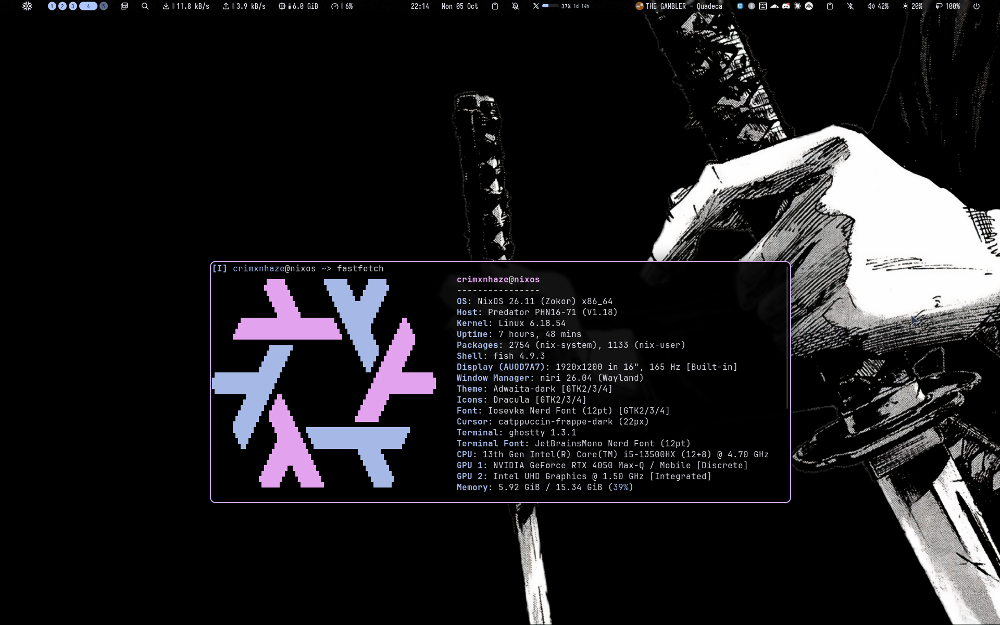

<div align="center">
  

  <h1>dotfiles</h1>

  <i>JLC's NixOS Dotfiles.</i>

  <br><br>
  
</div>

### Overview

Minimal, reinstall-reproducible NixOS flake. `main` and `clean-repro` point at the same commit. Highlights:

- **Shell**: Noctalia v5 (nixpkgs build, so it shares glibc with the GL drivers; no more DMS)
- **Lock**: qylock (Quickshell `qylock-lock`, same theme as login)
- **WM**: niri + custom keybinds (Noctalia IPC)
- **Editor**: nvf (Neovim); duplicate `programs.neovim` disabled
- **Login**: SDDM + qylock theme (Wayland), GNOME Keyring auto-unlocked via PAM so Electron apps can save sign-ins
- **AI tooling**: one `llm-agents` flake input (numtide, cached at `cache.numtide.com`) provides claude-code, codex, pi, omp, ccusage, herdr and grok-bot. A second instance that follows our nixpkgs is used only for the Electron apps (claude-desktop, hermes-desktop), because an older glibc cannot load system Mesa (blank window).
- **Packaged locally** (`pkgs/`, wired as overlays in `configuration.nix`): `t3code-nightly`, `tldraw-offline`, `recordly`, `aula-f75` (AULA F75 keyboard tool; config in `keyboard/`)
- **Ghostty**: config left unmanaged so Noctalia can write its theme into it

### Reinstall from scratch

**Full handoff (SSD2 backups, Helium, Hetzner keys, walls, agent restore):** see **[REINSTALL.md](./REINSTALL.md)**.

You only bootstrap the OS + flake; after SSD2 is mounted, tell the agent to restore everything per that file.

```bash
# 1. Clone on fresh NixOS
git clone https://github.com/blkflth/blkedn ~/blkedn
cd ~/blkedn
# main is current; clean-repro is kept as an identical alias

# 2. Generate hardware config (overwrite the tracked one)
nixos-generate-config --show-hardware-config > hardware-configuration.nix

# 3. Build & switch (no --impure needed)
sudo nixos-rebuild switch --flake .#nixos

# 4. Set user password
sudo passwd crimxnhaze
```

**Notes**:

- `host/priv/` is reference-only and not imported (the import is commented out in `host/host-configuration.nix`). Its files are git-crypt encrypted in the repo, so ignore them on a fresh clone.
- Claude Desktop Cowork needs FHS paths (OVMF, virtiofsd) and `vhost_vsock`; these are set up via `systemd.tmpfiles` in `host/programs.nix`.
- Binary caches are pre-configured (see **Binary caches** below) so rebuilds prefer substitutes over compiling.
- Lock: run `qylock-lock` or bind it to a key (`Mod+Alt+L`).
- Walls live on SSD2 (`~/walls` → `SSD2/walls`); not in git.
- NVIDIA + Intel PRIME offload configured (`hw/nvidia.nix`); AMD video driver removed.
- Fish aliases are pure (no `--impure`); `nh` flakes are explicit.

### Structure

```
flake.nix          — inputs (noctalia, qylock, llm-agents; no quickshell/DMS)
configuration.nix  — system config, users, hm wiring
home.nix           — user packages
host/
  programs.nix     — system packages, cachix
  noctalia.nix     — Noctalia NixOS module
  qylock.nix       — qylock NixOS module (SDDM theme + Quickshell lock)
  services.nix     — network, audio, fonts, portals, hotspot firewall, etc.
  greeter.nix      — SDDM (greetd disabled); theme via qylock
  virtualization.nix — libvirt, Docker, Podman, IOMMU
  user-settings.nix  — user, groups, session env
hw/
  nvidia.nix       — NVIDIA + Intel PRIME offload
  sleep.nix        — S3 sleep fixes
pkgs/              — local packages (t3code-nightly, tldraw-offline, recordly, aula-f75)
keyboard/          — AULA F75 keyboard config
rice/
  niri/            — niri keybinds, startup, layout, etc.
  nvf.nix          — Neovim via nvf
apps/
  fish.nix         — shell aliases
  editors.nix      — VS Codium; nvim disabled (nvf handles it)
  hotspot.nix      — Wi‑Fi hotspot CLI (home-manager package)
tools/
  hotspot/hotspot  — CLI source (up/down/tui/config)
```

### Binary caches

Configured in `host/programs.nix` and mirrored in `flake.nix` `nixConfig` so both system rebuilds and ad-hoc `nix` commands can download prebuilts.

| Cache | Covers |
|-------|--------|
| `cache.nixos.org` | nixpkgs / official |
| `noctalia.cachix.org` | Noctalia shell (`cachix` branch) |
| `niri.cachix.org` | niri-flake |
| `nvf` / `notashelf` | nvf Neovim |
| `zen-browser.cachix.org` | Zen browser flake |
| `kevinpita.cachix.org` | herdr (legacy) |
| `cache.numtide.com` | llm-agents.nix (claude-code, codex, pi, omp, ...) |
| `codex-desktop-linux.cachix.org` | codex-desktop-linux |
| `ezkea.cachix.org` | AAGL / game launchers |
| `nix-community.cachix.org` | community packages / HM-related |
| `cache.nixos-cuda.org` | NVIDIA/CUDA (old `cuda-maintainers.cachix.org` is gone) |
| `nix-gaming` / `nixpkgs-wayland` | gaming + Wayland |
| `numtide` / `helix` / `devenv` / `chaotic-nyx` | tooling + large prebuild sets |

Also: `always-allow-substitutes`, higher `max-substitution-jobs` / `http-connections`.  
**Still builds from source** when a flake has no public cache (e.g. helium, antigravity, qylock) or when you `override` a package (changes the drv hash). Prefer stock nixpkgs attrs when possible.

After editing caches: `nh os switch` (or `sudo nixos-rebuild switch --flake .#nixos`).

### Wi‑Fi hotspot CLI

Windows-style mobile hotspot: share this machine’s **LAN internet** over Wi‑Fi.

**Layout:** ethernet/LAN (`enp109s0`) → laptop → Wi‑Fi AP (`wlp0s20f3`) → phone.  
Clients get a private subnet (`10.42.0.x`) with NAT via NetworkManager shared mode (same model as Windows Mobile Hotspot). Prefer **5 GHz** (`band=a`) for throughput.

```bash
# first time
hotspot init
hotspot config set ssid='MyLAN' password='your-long-secret'
# or: hotspot tui

hotspot up
hotspot status
hotspot clients
hotspot qr      # phone QR (needs qrencode)
hotspot down
```

| Command | What it does |
|--------|----------------|
| `hotspot up` / `down` | Start / stop the AP |
| `hotspot status` | SSID, ifaces, AP IP, client count |
| `hotspot tui` | Interactive menu (fzf) |
| `hotspot config` | Show config (`~/.config/hotspot/config`) |
| `hotspot config set k=v` | Set keys (`ssid`, `password`, `band`, …) |
| `hotspot config edit` | Open config in `$EDITOR` |

**Config keys** (defaults in `~/.config/hotspot/config`):

- `ssid`, `password` (WPA2, 8–63 chars)
- `wifi_iface` / `upstream_iface` (empty = auto-detect)
- `band` — `a` (5 GHz, faster) or `bg` (2.4 GHz, longer range)
- `channel` — `0` = auto

Firewall trusts the AP iface (`wlp0s20f3`) in `host/services.nix` so DHCP/NAT is not blocked. Requires NetworkManager and a Wi‑Fi card with AP mode (Intel CNVi on this machine).

### Later

- **install keelcode** — not packaged yet, placeholder

### Back up Helium browser before reinstall

Helium is Chromium-based. Profile lives at `~/.config/net.imput.helium`.

```bash
# full profile (bookmarks, logins, extensions, history, sessions)
tar -czf ~/backups/helium-profile-$(date +%F).tar.gz -C ~/.config net.imput.helium

# restore after reinstall
mkdir -p ~/.config
tar -xzf helium-profile-YYYY-MM-DD.tar.gz -C ~/.config
```

Also export bookmarks JSON from Helium UI as a lightweight backup. Never commit profile (cookies/passwords) to git.

### Hetzner SSH key

Copy `~/.ssh/hetzner_key` + `.pub` offline (encrypted via age/USB). Never include in the flake.

### nix profile cleanup after switch

Once the rebuild proves all packages work:

```bash
nix profile remove ccusage fastfetch file-roller github-copilot-cli omp-nix pear-desktop witr ytmdesktop
# plus any leftover archive tools
```

### License

**[MIT License](LICENSE.md)**
